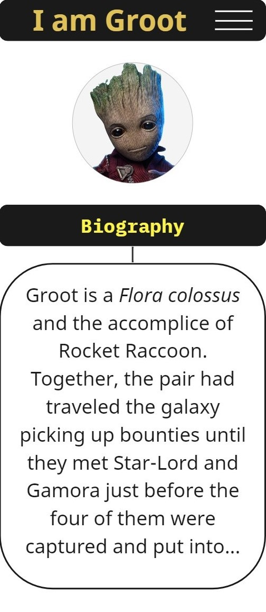

# Leniolabs_ Bootcamp: Homework 1

The project consists of creating a responsive landing page for a Marvel character, according to the requirements:

I've choose to make a landing page of <strong>Groot</strong>.   

# Objective
Demonstrate understanding of:
- GIT: Creating a repository, commits, branches, tipical workflow. 
- HTML: Basic structure, semantic tags, metadata.
- CSS: HTML integration, selectors, specificity, units, flexbox.
  

# Wireframes

### Mobile 1:
  

### Mobile 2:
  

### Tablet:
  

### Desktop:
  

# Author
Designed and developed by Fernando Chazarreta &#x1F464;

